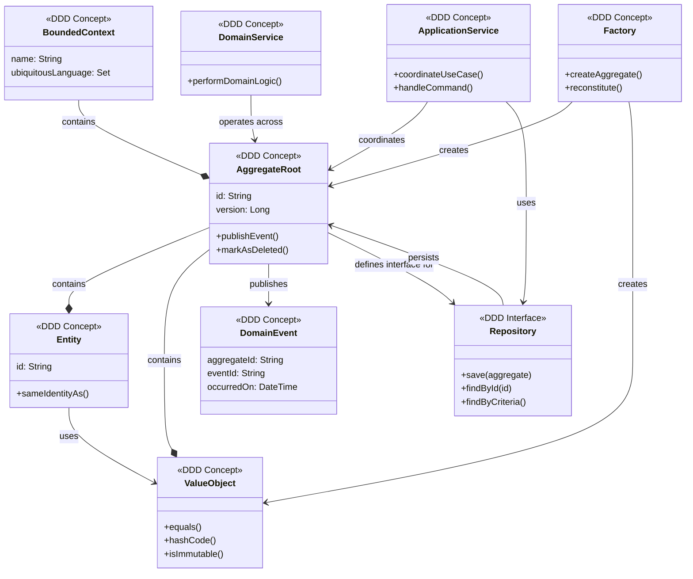

# Personal Finance

This project demonstrates the use of `Domain Driven Design` and Hexagonal architecture.

## Project Setup

This project uses Nix, and devenv to manage the build environment in a reproducible fashion.  
`devenv` integrates with `direvn` so that changing into the project directory automatically setups the build environment.

```bash
devenv up
devenv down
```

To start the project

```bash
spring init --build=maven --dependencies=web personal_finance
```

> :exclamation: Remember to replace the starter-xxx.jar with actual dependcies to minimize jar bloat.

To create remote repo and push local contents

```bash
gh repo create --public --source=. --remote=origin
git push origin
```

## DDD concepts in brief

[DDD Overview](https://www.domainlanguage.com/wp-content/uploads/2016/05/DDD_Reference_2015-03.pdf)


